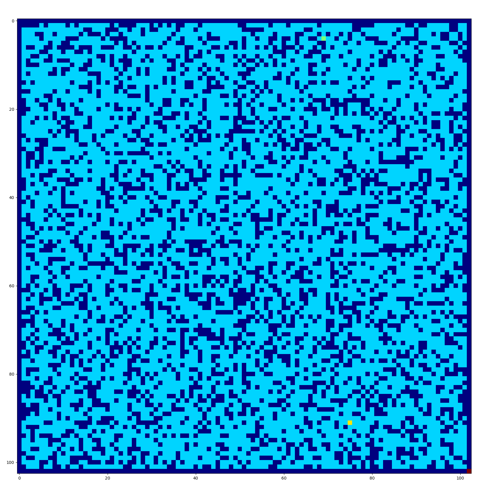
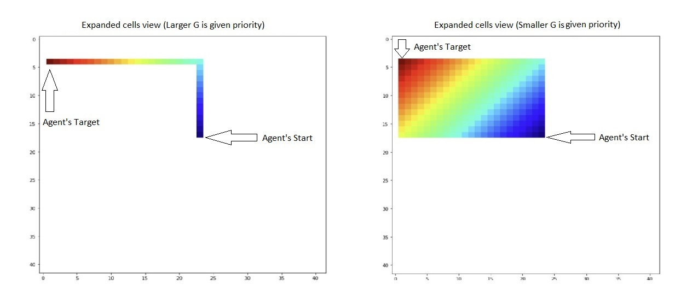

# Comparing different path finding algorithms
### Authors:
  Kush Jayank Pandya kp1127  
  Dwijesh Shah ds1991  
  Haarika Ambati ha539

## Part 0 - Setup your Environments

In this project, we created 50 grid worlds of size 103 x 103. Where the
borders, i.e. (0,0) to (0,103), (0,0) to (103,0), (0,103) to (103,103)
and (103,0) to (103,103)) are blocked by default, making the working
matrix of size 101 x 101. Randomized Depth-first search does the
generation of grids. We randomly picked a point in the 101 x 101 working
matrix and started by arbitrarily exploring its four neighbors (north,
east, west, and south) and continued the process until all the cells
were visited. Whenever the algorithm visits a cell, it will be assigned
as "blocked" or "unblocked" with the probabilities of 30 % and 70 %,
respectively.

We randomly select two points in the unblocked area of each maze and
mark them as the agent’s start and target.

<figure>
<figcaption aria-hidden="true">A random grid world generated by our algorithm</figcaption>
</figure>

## Part 1 - The Effects of Ties

**Repeated Forward A\* needs to break ties to decide which cell to
expand next if several cells have the same smallest f-value. It can
either break ties in favor of cells with smaller g-values or in favor of
cells with larger g-values. Implement and compare both versions of
Repeated Forward A\* with respect to their runtime or, equivalently,
number of expanded cells. Explain your observations in detail, that is,
explain what you observed and give a reason for the observation.**

The repeated forward A\* has been run on 50 grid worlds of size 101 x
101 for two scenarios to expand the cells when the tie is observed on
the same smallest f-values. The observation is as below,

| **Algorithms**                           | **Count** | **Mean** | **Std.Deviation** | **Min. Value** | **25%** | **50%** | **75%** | **Max. Value** |
|:-----------------------------------------|:----------|:---------|:------------------|:---------------|:--------|:--------|:--------|:---------------|
| Repeated Forward A\* (Higher G priority) | 50        | 1989.66  | 2323.028          | 16             | 721.5   | 1480.5  | 2644.75 | 11600          |
| Repeated Forward A\* (Lower G priority)  | 50        | 15007.02 | 23776.631         | 39             | 2733.75 | 6989.5  | 17263   | 135606         |

The statistics of 50 observations for Repeated Forward A\* with higher-G
priority and lower-G priority with respect to the number of expanded
cells

As shown above, when repeated forward A\* has been executed on 50 grids
worlds. The mean and median value, when larger-G has been taken as
priority, is smaller as compared to the mean value of smaller-G. From
the figure
<a href="#figs/figure-3" data-reference-type="ref" data-reference="fig:figure-3">4</a>
below, it’s clearly shown that during tie braking, when larger-G values
are given priority, then the number of expanded cells are lesser when
compared to the graph when smaller-G values are given priority. From the
above observations, one can easily say that larger-G values give optimum
results.

<figure>
<figcaption aria-hidden="true"> The effects of the tie resolution with higher-G priority(left) and lower-G priority(right) on the number of expanded cells.</figcaption>
</figure>

The result of the above observation is that the smaller G-values would
expand the cell closer to the starting point rather than the cell closer
to the endpoint. This would lead to the clustering of expanded cell
cells near the starting point and would use processing power in an
unfruitful manner.

# Part 2 - Forward vs. Backward

**Implement and compare Repeated Forward A\* and Repeated Backward A\*
with respect to their runtime or, equivalently, number of expanded
cells. Explain your observations in detail, that is, explain what you
observed and give a reason for the observation. Both versions of
Repeated A\* should break ties among cells with the same f-value in
favor of cells with larger g-values and remaining ties in an identical
way, for example randomly.**

We ran both(Repeated Forward A\* and Repeated Backward A\*) 50 times on
different grid worlds. The results for the same are shown in table
<a href="#table:2" data-reference-type="ref" data-reference="table:2">2</a>.
We can see that the Repeated forward A\* performs a lot better compared
to Repeated backward A\*.

| **Algorithms**        | **Count** | **Mean** | **Std.Deviation** | **Min. Value** | **25%** | **50%** | **75%** | **Max. Value** |
|:----------------------|:----------|:---------|:------------------|:---------------|:--------|:--------|:--------|:---------------|
| Repeated Forward A\*  | 50        | 1989.66  | 2323.028          | 16             | 721.5   | 1480.5  | 2644.75 | 11600          |
| Repeated Backward A\* | 50        | 8374.44  | 15064.396         | 15             | 1406.5  | 3740.5  | 8502    | 91475          |

The statistics of 50 observations for Repeated Forward A\* and Repeated
Backward A\* with respect to the number of expanded cells

We ran both(Repeated Forward A\* and Repeated Backward A\*) 50 times on
different grid worlds. The results for the same are shown in table
<a href="#table:2" data-reference-type="ref" data-reference="table:2">2</a>.
We can see that the Repeated forward A\* performs a lot better compared
to the Repeated backward A\*.

The results above can be explained by the figure below, where we can see
that the agent has more information about the environment near it than
at the endpoint. Due to this, repeated forward A\* can come out of the
know blockage faster and finds the remaining path. Because of this,
there are fewer numbers of cells having the same minimum f-value as the
known blockage is near the agent’s current position. On the contrary,
the repeated backward A\* would expand from the end and would reach the
blockage after expanding many cells. After expansion reaches the
blockage, it will expand the cell with the same minimum f-values, which
could have positions from the blockage to the endpoint.

<figure>
<figcaption aria-hidden="true"> The effects of the tie resolution with higher-G priority(left) and lower-G priority(right) on the number of expanded cells.</figcaption>
</figure>

# Part 3 - Heuristics in the Adaptive A\*

**Implement and compare Repeated Forward A\* and Adaptive A\* with
respect to their runtime. Explain your observations in detail, that is,
explain what you observed and give a reason for the observation. Both
search algorithms should break ties among cells with the same f-value in
favor of cells with larger g-values and remaining ties in an identical
way, for example randomly.**

We ran both(Repeated Forward A\* and Adaptive A\*) 50 times on different
grid worlds. The results for the same are shown in table
<a href="#table:3" data-reference-type="ref" data-reference="table:3">3</a>
for expanded cells and table
<a href="#table:4" data-reference-type="ref" data-reference="table:4">4</a>
for run time. We can see that the Adaptive A\* performs a little better
compared to Repeated forward A\* when it comes to expanded cells, but
Repeated forward A\* performs slightly better when compared to run time.

As per the results, it looks as if the extra computation needed to
update the H-values outweighs the benefit we get from expanding fewer
cells. However, we believe that as we expand the grid size, even more,
Adaptive A\* will become more optimal compared to Repeated forward A\*.

| **Algorithms**       | **Count** | **Mean** | **Std.Deviation** | **Min. Value** | **25%** | **50%** | **75%** | **Max. Value** |
|:---------------------|:----------|:---------|:------------------|:---------------|:--------|:--------|:--------|:---------------|
| Repeated Forward A\* | 50        | 1989.66  | 2323.028          | 16             | 721.5   | 1480.5  | 2644.75 | 11600          |
| Adaptive A\*         | 50        | 1942.04  | 2310.929          | 16             | 626.75  | 1310    | 2505.5  | 11580          |

The statistics of 50 observations for Repeated Forward A\* and Adaptive
A\* with respect to the number of expanded cells

| **Algorithms**       | **Count** | **Mean** | **Std.Deviation** | **Min. Value** | **25%**  | **50%**  | **75%**  | **Max. Value** |
|:---------------------|:----------|:---------|:------------------|:---------------|:---------|:---------|:---------|:---------------|
| Repeated Forward A\* | 50        | 0.027428 | 0.033481          | 0.002999       | 0.006834 | 0.015864 | 0.032065 | 0.150523       |
| Adaptive A\*         | 50        | 0.038574 | 0.044483          | 0.003255       | 0.010302 | 0.019595 | 0.043826 | 0.215683       |

The statistics of 50 observations for Repeated Forward A\* and Adaptive
A\* with respect to run time in seconds

